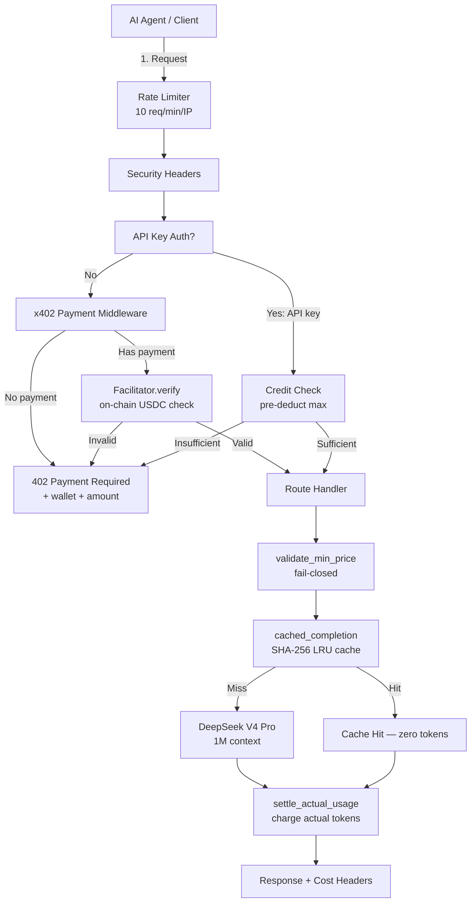

# AI Agent API — 25 REST + 30 MCP AI services via USDC micropayments

[](https://github.com/AntoNYak0/ai-agent-api/actions/workflows/ci.yml)
[](LICENSE)
[](https://agent-api-ai.duckdns.org/mcp/sse)
[](https://www.python.org)
[](https://xcash.is)

**DeepSeek V4 Pro (1M context) · x402 micropayments · MCP for AI agents · API keys for humans**

> The first pay-per-use AI API built for Web3 agents. No subscriptions. No API tiers. Pay $0.001–$1.00 per call in USDC — only for what you use.

---

## Contents

- [Why This Exists](#why-this-exists)
- [Quick Start](#quick-start)
- [Architecture](#architecture)
- [Services](#30-mcp-tools--25-rest-services)
- [Payment Methods](#payment-methods)
- [MCP Connection](#mcp-ai-agent-connection)
- [Agent Discovery](#agent-discovery)
- [FAQ](#faq)
- [Roadmap](#roadmap)
- [Security](#security)
- [Contributing](#contributing)

---

## Why This Exists

AI agents need tools. But every AI API requires a credit card, a subscription, or an API key from a centralized provider. **Web3 agents use crypto — they should pay in crypto.**

This API is a **toolbox for AI agents** running in Claude Code, Cursor, or any MCP-compatible client. Every tool costs a few cents. You pay per use via x402 (USDC on Base L2 — gas ~$0.001). No account needed.

### Who Uses This

| Who | Uses | For |
| --- | --- | --- |
| **Solidity dev** | `solidity-scan` + `contract-verify` | Scan contracts for 36 SWC vulnerabilities before deploy |
| **DeFi analyst** | `whale-tracker` + `smart-money` + `defi-research` | Track whale wallets, copy-trade smart money, analyze protocols |
| **Code reviewer** | `audit` + `refactor` + `code-health-check` | Security audit → refactor → generate docs in one pipeline |
| **Data engineer** | `nl-to-sql` + `extract-data` + `data-pipeline` | Natural language → SQL → structured extraction → formatted output |
| **Security researcher** | `agent-audit` + `security-score` | Audit AI agents for prompt injection, tool misuse, trust scoring |
| **DevOps** | `debug-log` + `git-summarize` | Parse CI errors, auto-generate PR descriptions from git diff |

---

## Quick Start

### For AI Agents (MCP + x402 crypto)

```bash
# 1. Connect your agent — no API key needed
# Claude Code:
/mcp add --transport sse https://agent-api-ai.duckdns.org/mcp/sse

# 2. Call any tool — get 402 with payment details
# The tool response tells you where to send USDC and how much

# 3. Send USDC to the wallet from the 402 response
# 4. Retry — tool executes, result returned
```

**MCP tools use `payment_tx` parameter** — paste your transaction hash after sending USDC.

### For Developers (API keys)

```bash
# 1. Get a free API key (50 free credits = $0.05)
curl -X POST https://agent-api-ai.duckdns.org/billing/create-key
# → {"api_key": "ak-abc123...", "credits": 50}

# 2. Call any service
curl -X POST https://agent-api-ai.duckdns.org/api/audit \
  -H "Content-Type: application/json" \
  -H "Authorization: Bearer ak-abc123..." \
  -d '{"code": "function transfer(to, amount) { ... }"}'

# 3. Top up with crypto when credits run low
curl -X POST https://agent-api-ai.duckdns.org/billing/register-wallet \
  -H "Content-Type: application/json" \
  -d '{"api_key":"ak-abc123...","wallet":"0xYourWallet"}'
# Send USDC to 0xdE7eb04faE758055642f67f30D246CcB7136C95E on Base
# Credits appear automatically in ~60 seconds. Bonus: $10→+10%, $50→+20%, $100→+30%
```

### Explore Without Code

```bash
# Service manifest with all prices
curl https://agent-api-ai.duckdns.org/.well-known/x402

# OpenAPI 3.1 spec
curl https://agent-api-ai.duckdns.org/.well-known/openapi.json

# Trigger 402 to see payment flow
curl -X POST https://agent-api-ai.duckdns.org/api/validate-json \
  -H "Content-Type: application/json" \
  -d '{"data": "{\"name\": \"test\"}"}'
# → HTTP 402 + PAYMENT-REQUIRED header with wallet and amount
```

---

## Architecture



| Layer | Detail |
| --- | --- |
| **Payment networks** | Base, Arbitrum, Optimism, BNB Chain (USDC) + Tron (USDT) |
| **Cache** | 1000 entries, 10-min TTL, SHA-256 keyed — repeat calls are free |
| **Security** | 12 regex injection patterns, circuit breaker, exponential backoff retry, replay protection |
| **Facilitator modes** | PayAI, Direct (Transfer + EIP-3009), CDP, ChaosChain |

---

## 30 MCP Tools + 25 REST Services

### AI Services (upto pricing — pay for actual token usage)

| Service | Price | Description |
| --- | --- | --- |
| `audit` | $0.01–$0.05 | Security scan — OWASP Top 10 + SWC Registry |
| `refactor` | $0.01–$0.05 | Legacy code modernization (DRY, SOLID) |
| `docs` | $0.005–$0.03 | Technical documentation from code |
| `defi-analyze` | $0.01–$0.04 | DeFi protocol analysis (training data only) |
| `trading-signal` | $0.005–$0.03 | Crypto market analysis (NOT financial advice) |
| `solidity-scan` | $0.02–$0.08 | Solidity vulnerability scanner (36 SWC checks) |
| `nl-to-sql` | $0.005–$0.03 | Natural language → SQL |
| `sql-to-nl` | $0.005–$0.02 | SQL → plain English |
| `translate-code` | $0.01–$0.05 | Code translation (Python, TS, Rust, Go, Solidity) |
| `git-summarize` | $0.005–$0.02 | Git diff → PR description |

### DeFi Signals (upto pricing)

| Service | Price | Description |
| --- | --- | --- |
| `whale-tracker` | $0.015–$0.03 | Whale wallet movement tracking on Base/Arbitrum |
| `smart-money` | $0.025–$0.05 | Smart money wallet analysis — win rate, PnL patterns |
| `price-feed` | $0.01–$0.02 | AI-enhanced token price analysis with S/R levels |

### Security (upto pricing)

| Service | Price | Description |
| --- | --- | --- |
| `agent-audit` | $0.25–$0.50 | Full AI agent security audit — code, behavior, trust score |
| `contract-verify` | $0.50–$1.00 | Smart contract formal verification — 36 SWC + DeFi exploits |
| `security-score` | $0.05–$0.10 | Rapid security assessment — quick score and risk level |
| `amm-security-check` | $0.02–$0.05 | AMM pool security — sandwich attacks, impermanent loss, TVL risks |

### Data & DevOps

| Service | Price | Description |
| --- | --- | --- |
| `data-feed` | $0.01–$0.02 | Structured data feed on any topic — machine-readable JSON |
| `debug-log` | $0.01–$0.03 | CI/CD error log analysis — root cause and fix suggestions |

### Micro-tasks (exact pricing)

| Service | Price | Description |
| --- | --- | --- |
| `validate-json` | $0.001 | Validate JSON/YAML structure |
| `classify-text` | $0.001 | Sentiment, category, keywords |
| `extract-data` | $0.005 | Extract names, emails, phones, URLs |
| `generate-regex` | $0.002 | Regex from description with tests |
| `format-data` | $0.003 | Convert CSV/JSON/YAML |
| `summarize` | $0.002 | Summarize text to N words |

### Composite Skills (multi-step pipelines)

| Service | Price | Chain |
| --- | --- | --- |
| `defi-research` | $0.08 | Extract → Analyze → Summarize |
| `code-health-check` | $0.10 | Audit → Refactor → Document |
| `smart-contract-audit` | $0.10 | Scan → Document |
| `data-pipeline` | $0.05 | Extract → Format → Summarize |
| `run-workflow` | variable | User-registered composite workflows |

---

## Payment Methods

### x402 Protocol (AI agents)

USDC on Base, Arbitrum, Optimism, BNB Chain or USDT on Tron. No API key needed — your agent pays in crypto.

| Network | Token | Wallet |
| --- | --- | --- |
| Base | USDC | `0xdE7eb04faE758055642f67f30D246CcB7136C95E` |
| Arbitrum | USDC | `0xdE7eb04faE758055642f67f30D246CcB7136C95E` |
| Optimism | USDC | `0xdE7eb04faE758055642f67f30D246CcB7136C95E` |
| BNB Chain | USDC | `0xdE7eb04faE758055642f67f30D246CcB7136C95E` |
| Tron | USDT | `TADavZEHddjYMQcL2cnaFadFVKAUmP9wMw` |

**REST flow:** Call → 402 response with `PAYMENT-REQUIRED` header + wallet + amount → Send USDC → Retry with `payment-signature` header → Verified on-chain → Result

**MCP flow:** Call tool without `payment_tx` → Error with payment details → Send USDC → Retry with `payment_tx=<tx-hash>` → Verified on-chain → Result

**EIP-3009 (gasless):** Client signs EIP-712 `ReceiveWithAuthorization` off-chain → Server submits on-chain (~$0.001 gas, paid by server). Emits `AuthorizationUsed` event — visible to indexers.

### API Keys (human developers)

```bash
# Create key (50 free credits)
curl -X POST https://agent-api-ai.duckdns.org/billing/create-key

# Check balance
curl "https://agent-api-ai.duckdns.org/billing/balance?key=ak-YOUR_KEY"

# Register wallet for auto-top-up
curl -X POST https://agent-api-ai.duckdns.org/billing/register-wallet \
  -H "Content-Type: application/json" \
  -d '{"api_key":"ak-...","wallet":"0x..."}'

# Call with key
curl -X POST https://agent-api-ai.duckdns.org/api/audit \
  -H "Content-Type: application/json" \
  -H "Authorization: Bearer ak-YOUR_KEY" \
  -d '{"code": "function transfer(to, amount) { ... }"}'
```

**Top-up bonus:** $10→+10%, $50→+20%, $100→+30%. Credits auto-credited ~60s after on-chain confirmation.

---

## Docker

```bash
docker build -t agent-api .
docker compose up -d
curl http://localhost:8000/health
```

---

## MCP (AI Agent Connection)

**SSE Endpoint:** `https://agent-api-ai.duckdns.org/mcp/sse`

### One-Click Install

| Client | Install |
| --- | --- |
| **Smithery** | `npx -y smithery mcp add antoNYak0/ai-agent-api` |
| **Cursor** | [Add to Cursor](cursor://mcp/install?name=ai-agent-api&type=http&url=https://agent-api-ai.duckdns.org/mcp/sse) |
| **Claude Code** | `/mcp add --transport sse https://agent-api-ai.duckdns.org/mcp/sse` |
| **VS Code** | Add `https://agent-api-ai.duckdns.org/mcp/sse` in MCP settings |

### Listed On

| Marketplace | Status | Discovery |
| --- | --- | --- |
| [Smithery.ai](https://smithery.ai/servers/antoNYak0/ai-agent-api) | ✅ Live | `smithery.yaml` + `/.well-known/mcp/server-card.json` |
| [Glama.ai](https://glama.ai/mcp/servers?query=agent-api) | ✅ Live | `/.well-known/glama.json` (auto-indexed) |
| [mcp.so](https://mcp.so) | ⏳ Review | `mcp.json` + [Issue #2453](https://github.com/chatmcp/mcpso/issues/2453) |
| [MCP Registry](https://registry.modelcontextprotocol.io) | 📋 Planned | `server.json` (PR pending) |
| [PulseMCP](https://pulsemcp.com) | 🔄 After Registry | Auto-ingests from MCP Registry |

---

## Agent Discovery

7 well-known endpoints for automatic discovery by marketplaces and agent frameworks:

| Endpoint | Purpose |
| --- | --- |
| `/.well-known/x402` | x402 payment manifest (all 25 services + prices) |
| `/.well-known/openapi.json` | OpenAPI 3.1 spec with x402 extensions |
| `/.well-known/mcp/server-card.json` | Smithery server card (30 tools) |
| `/.well-known/glama.json` | Glama auto-discovery |
| `/.well-known/agent-card.json` | A2A Agent Card |
| `/.well-known/agentic-market-services.json` | Agentic Market listing |
| `/.well-known/agent.json` | AP2 Agent Payments Protocol |

---

## FAQ

**Q: How does "upto" pricing work?**
You authorize a max amount (e.g. $0.05). We charge only for actual tokens used — if the AI responds in 100 tokens instead of 3000, you pay ~$0.01. The max is a ceiling, not the price. This differs from micro-tasks which have exact flat prices.

**Q: What's the difference between REST endpoints and MCP tools?**
Same AI services, different interfaces. REST uses HTTP POST with x402 headers (`/api/audit`). MCP uses the Model Context Protocol over SSE (`/mcp/sse`) — designed for AI agents in Claude Code, Cursor, etc. MCP tools pass `payment_tx` as a parameter; REST uses HTTP headers.

**Q: What happens if I overpay?**
For Transfer payments: the excess stays with the server (like a tip). Use exact amounts. For EIP-3009: exact settlement, no overpayment possible.

**Q: How fast is payment verification?**
~1-3 seconds on Base L2 (1 block confirmation). Tron may take 5-10 seconds.

**Q: Can I get a refund?**
No refunds — AI computation is consumed instantly. Start with small amounts to test.

**Q: What if the AI errors out?**
You're charged only for tokens consumed before the error. The `X-Actual-Cost` response header always shows what you paid.

**Q: Is my code stored or logged?**
No. Code is hashed for caching (SHA-256, 10-min TTL) but never stored in plaintext. Cache entries are in-memory only.

**Q: What chains are supported?**
Base, Arbitrum, Optimism, BNB Chain (USDC) + Tron (USDT). Base is recommended — lowest gas fees.

**Q: Can I use this from a script without an AI agent?**
Yes — use API keys. `POST /billing/create-key` gets you 50 free credits.

**Q: How do composite skills work?**
They chain 2-3 AI calls into one pipeline. E.g., `code-health-check` runs `audit` → `refactor` → `docs` sequentially. You get all three results for one flat price.

**Q: Do I need KYC?**
No KYC for x402 crypto payments or API keys. Only Coinbase CDP facilitator mode requires KYC (and it's not the default).

---

## Roadmap

- [x] x402 USDC payments (Transfer + EIP-3009)
- [x] API key credit system with crypto auto-top-up
- [x] 30 MCP tools + MCP SSE transport
- [x] Smithery + Glama marketplace listings
- [x] 7 well-known discovery endpoints
- [x] LRU cache (10-min TTL, free repeat calls)
- [ ] MCP Registry official listing (PR pending)
- [ ] mcp.so listing
- [ ] PayAI Bazaar listing (KYC blocked — Russia)
- [ ] Multi-agent workflow marketplace
- [ ] Streaming responses via SSE (`/api/stream/{service}`)
- [ ] Result marketplace — buy cached AI results from other agents

---

## Response Format

All services return a consistent JSON envelope:

```json
{
  "result": "{\"valid\": true, \"errors\": [], \"warnings\": []}",
  "payment_network": "eip155:8453",
  "payment_tx": "0x..."
}
```

Response headers include `X-Actual-Cost` (what you were charged) and `X-Cache-Hit` (whether the result came from cache).

---

## Security

- **[SECURITY.md](SECURITY.md)** — full security policy with attack detection
- **`/health/security`** — real-time security status endpoint
- **`/health/metrics`** — Prometheus metrics (rate limits, replay blocks, injection attempts, revenue)
- **12 regex patterns** — prompt injection defense (jailbreak, role-switching, prompt leakage)
- **Rate limiting** — 10 req/min per IP + cumulative block counter
- **Replay protection** — SQLite-backed payment tx dedup (30-min TTL)
- **API keys** — SHA-256 hashed at rest, atomic file writes

---

## Contributing

See [CONTRIBUTING.md](CONTRIBUTING.md) for guidelines including architecture overview, PR checklist, and how to add new AI services.

Quick links:
- [Report a bug](https://github.com/AntoNYak0/ai-agent-api/issues/new?template=bug_report.md)
- [Request a feature](https://github.com/AntoNYak0/ai-agent-api/issues/new?template=feature_request.md)
- [Ask a question](https://github.com/AntoNYak0/ai-agent-api/discussions)

---

## Links

- [Dashboard](https://agent-api-ai.duckdns.org/) — Live service status + crypto top-up
- [Swagger Docs](https://agent-api-ai.duckdns.org/docs) — Interactive API reference
- [Health Check](https://agent-api-ai.duckdns.org/health)
- [OpenAPI Spec](https://agent-api-ai.duckdns.org/.well-known/openapi.json)
- [x402 Manifest](https://agent-api-ai.duckdns.org/.well-known/x402)
- [Security Status](https://agent-api-ai.duckdns.org/health/security)
- [Prometheus Metrics](https://agent-api-ai.duckdns.org/health/metrics)
- [AGENTS.md](AGENTS.md) — Instructions for AI agents connecting to this server
